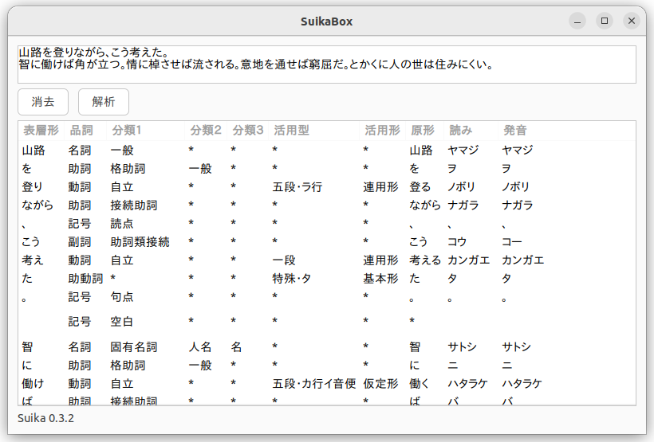

# 🍉 SuikaBox 📦

GUI for [Suika](https://github.com/yoshoku/suika) -  Japanese morphological analyzer written in pure Ruby



## Usage

```
git clone https://github.com/kojix2/suikabox
bundle install
bundle exec ruby main.rb
```
